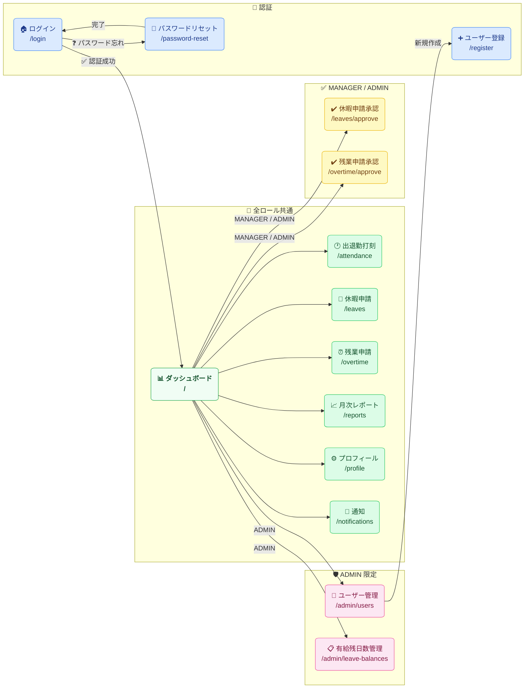
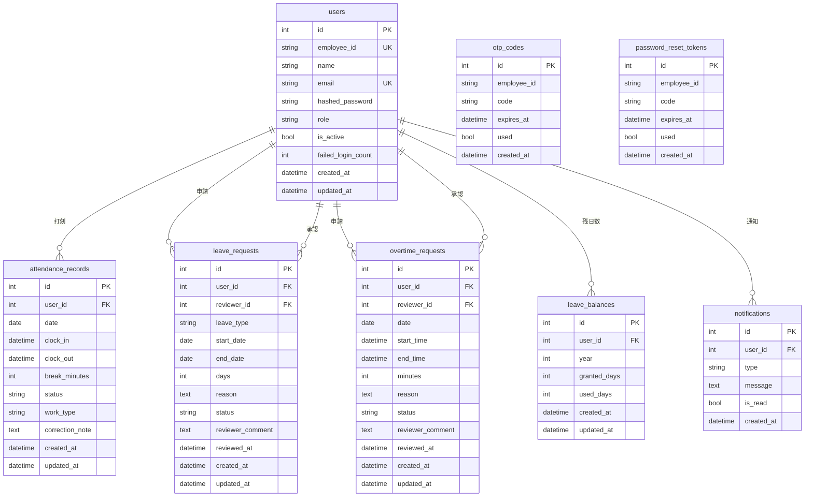

# AttendEase - 勤怠管理システム

小規模チーム（〜50人）向けの勤怠登録・管理アプリです。無料のOSS技術のみで構築しています。

> [!IMPORTANT]
> **複数ユーザーで同時に動作確認する場合は、異なるブラウザを使用してください。**
> 同一ブラウザでは複数タブを開いてもセッションが共有されるため、別ユーザーとしてログインできません。
> （例：管理者はBrave 、一般社員は Google Chrome、承認担当者は Safariの中のGoogleChrome）

---
## AttendEase(勤怠管理システム)の流れ
1.「http://localhost:3000/login」にアクセスすると「ログイン画面」が、表示されます。


2.一般社員:新規ログインする場合は、新規登録をクリックしてください。新規登録の完了を登録をする前に、必ず、「社員ID」と「パスワード」はメモするようにお願いします。新規アカウントに必要な「社員ID」、「氏名」、「メールアドレス」、「パスワード」を入力して、「登録」をクリックして完了するとログイン画面に戻り、新規アカウントの作成が完了しました。


⚠️既存のアカウントで、正しいユーザーIDとパスワードを入力に「３回失敗」すると「アカウントロックになりますので、ご注意ください。


3.一般社員:新規アカウントで作成したユーザーIDとパスワードを入力後、「次へ進む」をクリックしてください。


※間違った社員IDまたはパスワードを入力してログインしますと、「社員IDまたはパスワードが正しくありません」とエラーが表示されますので、ご注意ください。


4. 一般社員:「認証コード」を認証コードのフォームに入力して、ログインしてください。※もし、時間内に入力できない場合は、「再送信」をクリックして、認証コードのフォームに入力してください。


5.一般社員:一般社員のログイン画面が表示されます。


6.勤怠登録の「出勤」と「退勤」では、手動での入力もしくは、時計のアイコンをクリックして、数字を選択しての時間設定を行い、出勤すると退勤するをクリックしてください。。※「出勤」のみが、出勤もしくは、リモートを選択することができます。


(出勤もしくは、リモートの場合)


(退勤の場合)


7.「勤怠の時間」の結果が表示されます。※もし、出勤もしくは、退勤で、間違って入力した時間を修正することも可能です。


8.一般社員:休暇申請の場合、「休暇申請」をクリックします。→新規作成をクリックします。→「休暇種別」、「日時」、「申請理由」を入力して、「申請する」をクリックしてください。


※休暇申請で、日数が０の場合、申請できず、エラーになりますので、ご注意ください。


9.システム管理者:もし、休暇申請日数が足りない場合は、システム管理者で、メニューの中から「有給残日数管理」をクリックしてください。→「有給残日数管理」が表示されますので、一般ユーザーの中から編集をクリックしてください→休暇日数の数字を入力した上で、保存してください。


10.承認担当者:通知が届きますので、通知を確認した上で、承認メニューの中から「休暇承認」をクリックしてください。→「承認」もしくは、「却下」を選択してください。コメントで、承認や却下の理由を添えると一般ユーザーも納得しますので、コメントを添えてから、「承認する」をクリックしてください。


11.一般社員：休暇申請で、「承認済み」になっていれば、休暇申請は受理されることになります。


12:一般社員:残業時間を取る場合は、「残業申請」の所をクリックしてください。→「新規作成」をクリックしてください。


13.一般社員:残業日、時刻、申請理由を記入した上で、「申請する」をクリックしてください。


14:承認担当者:通知音が鳴り、「残業申請の通知」を確認します。


15:承認担当者:承認メニューの中から「残業承認」をクリックします。→内容を確認した上で、「承認」もしくは、「却下」を選択してクリックした後、コメントを記入した上で、「承認する」もしくは、「却下する」を選択してクリックしてください。


16:承認担当者:「勤怠レポート」をクリックしてください。→勤怠、休暇、残業についてのデータをCSVでダウンロードしたり、印刷することができます。
※一般社員では、「勤怠レポート」を確認できない点は、気を付けてください。それとSafariでは、「印刷」を直接使用できないとなっていますので、ご注意ください。→ショートカットキーを使用すれば、印刷できます。Windows:Ctrl + P   Mac:command + P


※印刷成功した時の勤怠レポート(写真)


17:一般社員：「プロフィール設定」をクリックしてください。→基本情報で、「社員ID」や「ロール」以外は、変更できます。


18:システム管理者：管理者メニューの中で、「ユーザー管理」をクリックしてください。→新規一般社員のユーザーのアカウントを作ることができます。


---

## 機能

- 出退勤打刻（修正申請あり）
- 休暇申請・承認ワークフロー（有給残日数管理）
- 残業申請・承認ワークフロー（月次アラート）
- レポート・CSV出力

## ロール

| ロール | 権限 |
|--------|------|
| EMPLOYEE | 打刻・各種申請 |
| MANAGER | 部下の申請承認 |
| ADMIN | ユーザーアカウント管理・**新規ユーザー登録（ADMIN のみ可能）** |

> ユーザーの新規登録はシステム管理者（ADMIN）のみが行えます。一般社員・承認担当者は自己登録できません。

---

## 技術スタック

| 領域 | 技術 |
|------|------|
| フロントエンド | Vue 3 / Nuxt 3 / TypeScript / Tailwind CSS / Nuxt UI / Pinia |
| バックエンド | FastAPI / SQLAlchemy 2.0 / Alembic / python-jose / Pydantic v2 |
| データベース | SQLite 3 |
| インフラ | Docker / Docker Compose |

---

## 開発環境のセットアップ

### 必要なもの

- Docker
- Docker Compose

### 起動手順

**1. リポジトリをクローン**

```bash
git clone https://github.com/<your-username>/AttendEase.git
cd AttendEase
```

**2. 環境変数ファイルを作成**

```bash
cp .env.example .env
```

`.env` を開いて `JWT_SECRET_KEY` を任意の文字列に変更してください。

**3. Docker を起動**

```bash
docker compose up --build -d
```

**4. データベースの初期化**

```bash
# テーブル作成
docker compose exec backend alembic upgrade head

# テストユーザーの投入
docker compose exec backend python -m scripts.seed
```

**5. ブラウザでアクセス**

| URL | 説明 |
|-----|------|
| http://localhost:3000 | フロントエンド |
| http://localhost:8000/docs | バックエンド API ドキュメント |

### テストユーザー

| 社員ID | パスワード | ロール |
|--------|-----------|--------|
| ADMIN001 | Admin1234! | システム管理者 |
| EMP002 | NewPass456! | 承認担当者 |
| EMP001 | Password1! | 一般社員 |

> **複数ユーザーで同時に動作確認する場合は、異なるブラウザを使用してください。**
> 同一ブラウザではセッションが共有されるため、別ユーザーとしてログインできません。
>
> ブラウザの例：Google Chrome / Firefox / Safari / Microsoft Edge

### 停止・削除

**コンテナを停止する（データは保持）**

```bash
docker compose stop
```

**コンテナを停止して削除する（データは保持）**

```bash
docker compose down
```

**コンテナ・ボリューム・イメージをすべて削除する（データも消える）**

```bash
docker compose down --volumes --rmi all
```

> [!WARNING]
> `--volumes` を付けるとデータベースのデータも削除されます。再度 `alembic upgrade head` と `scripts.seed` の実行が必要です。

---

## 画面遷移図



---

## 画面モックアップ

### ログイン画面

```
┌─────────────────────────────────┐
│         AttendEase              │
│─────────────────────────────────│
│  社員ID    [__________________] │
│  パスワード[__________________] │
│                                 │
│      [ ログイン ]               │
│                                 │
│  パスワードをお忘れの方はこちら  │
└─────────────────────────────────┘
```

### パスワードリセット（2ステップ）

```
Step 1: 社員ID入力          Step 2: コード＋新パスワード入力
┌────────────────────┐     ┌────────────────────────────────┐
│ パスワードをリセット│     │ 新しいパスワードを設定          │
│────────────────────│     │────────────────────────────────│
│ 社員ID             │     │ ※ re***@example.com に送信済み │
│ [_______________]  │     │                                │
│                    │     │ 認証コード（6桁）               │
│ [ 認証コードを送信 ]│     │ [______]  有効期限: 10分       │
│                    │     │                                │
│ ログインに戻る     │     │ 新しいパスワード               │
└────────────────────┘     │ [____________________________] │
                           │ パスワード（確認）             │
                           │ [____________________________] │
                           │ [ パスワードをリセット ]       │
                           │ [ コードを再送信する ]         │
                           │ [ 戻る ]                      │
                           └────────────────────────────────┘
```

### ダッシュボード（打刻カード）

```
┌──────────────────────────────────────────────┐
│  AttendEase        🔔 通知  👤 山田太郎       │
│──────────────────────────────────────────────│
│  今日: 2026-06-06（土）                       │
│  ┌─────────────────────────────────────────┐ │
│  │  出社形態: ( 出社 ) / ( リモート )       │ │
│  │  出勤時刻: 09:00    退勤時刻: ──:──      │ │
│  │                                         │ │
│  │   [ 出勤打刻 ]      [ 退勤打刻 ]        │ │
│  └─────────────────────────────────────────┘ │
│  今月の勤務時間: 80h    有給残日数: 12日      │
└──────────────────────────────────────────────┘
```

---

## E-R 図



---

## ブランチ運用ルール

- `main` ブランチへの直接 push は禁止しています
- 作業は `feature/xxx` などのブランチで行い、Pull Request を通してください

```bash
git checkout -b feature/your-branch-name
```
