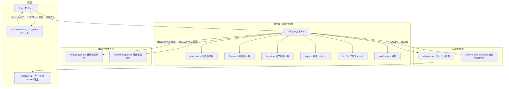
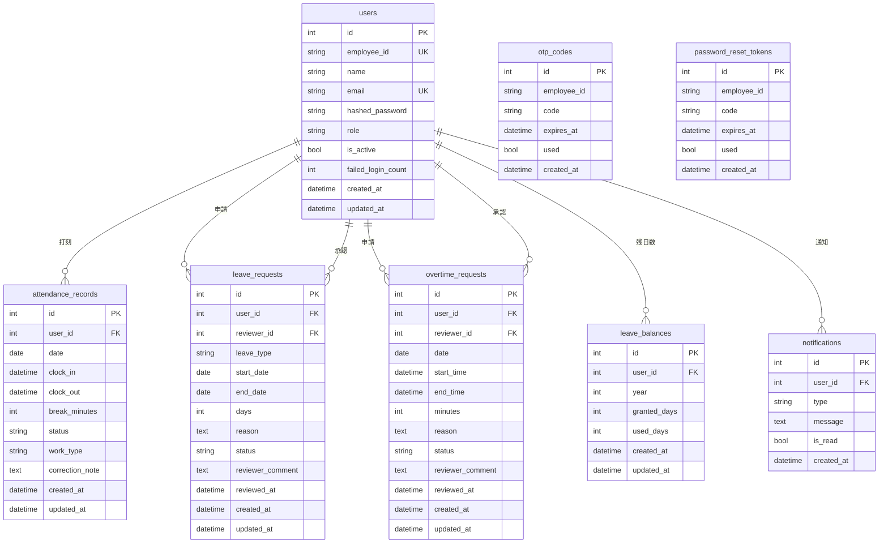

# AttendEase - 勤怠管理システム

小規模チーム（〜50人）向けの勤怠登録・管理アプリです。無料のOSS技術のみで構築しています。

> [!IMPORTANT]
> **複数ユーザーで同時に動作確認する場合は、異なるブラウザを使用してください。**
> 同一ブラウザでは複数タブを開いてもセッションが共有されるため、別ユーザーとしてログインできません。
> （例：管理者は Chrome、一般社員は Firefox、承認担当者は Safari）

---

## 機能

- 出退勤打刻（修正申請あり）
- 休暇申請・承認ワークフロー（有給残日数管理）
- 残業申請・承認ワークフロー（月次アラート）
- レポート・CSV出力

## ロール

| ロール | 権限 |
|--------|------|
| EMPLOYEE | 打刻・各種申請 |
| MANAGER | 部下の申請承認 |
| ADMIN | ユーザーアカウント管理・**新規ユーザー登録（ADMIN のみ可能）** |

> ユーザーの新規登録はシステム管理者（ADMIN）のみが行えます。一般社員・承認担当者は自己登録できません。

---

## 技術スタック

| 領域 | 技術 |
|------|------|
| フロントエンド | Vue 3 / Nuxt 3 / TypeScript / Tailwind CSS / Nuxt UI / Pinia |
| バックエンド | FastAPI / SQLAlchemy 2.0 / Alembic / python-jose / Pydantic v2 |
| データベース | SQLite 3 |
| インフラ | Docker / Docker Compose |

---

## 開発環境のセットアップ

### 必要なもの

- Docker
- Docker Compose

### 起動手順

**1. リポジトリをクローン**

```bash
git clone https://github.com/<your-username>/AttendEase.git
cd AttendEase
```

**2. 環境変数ファイルを作成**

```bash
cp .env.example .env
```

`.env` を開いて `JWT_SECRET_KEY` を任意の文字列に変更してください。

**3. Docker を起動**

```bash
docker compose up --build -d
```

**4. データベースの初期化**

```bash
# テーブル作成
docker compose exec backend alembic upgrade head

# テストユーザーの投入
docker compose exec backend python -m scripts.seed
```

**5. ブラウザでアクセス**

| URL | 説明 |
|-----|------|
| http://localhost:3000 | フロントエンド |
| http://localhost:8000/docs | バックエンド API ドキュメント |

### テストユーザー

| 社員ID | パスワード | ロール |
|--------|-----------|--------|
| ADMIN001 | Admin1234! | システム管理者 |
| EMP002 | Password1! | 承認担当者 |
| EMP001 | Password1! | 一般社員 |

> **複数ユーザーで同時に動作確認する場合は、異なるブラウザを使用してください。**
> 同一ブラウザではセッションが共有されるため、別ユーザーとしてログインできません。
>
> ブラウザの例：Google Chrome / Firefox / Safari / Microsoft Edge

### 停止

```bash
docker compose down
```

---

## 画面遷移図



---

## 画面モックアップ

### ログイン画面

```
┌─────────────────────────────────┐
│         AttendEase              │
│─────────────────────────────────│
│  社員ID    [__________________] │
│  パスワード[__________________] │
│                                 │
│      [ ログイン ]               │
│                                 │
│  パスワードをお忘れの方はこちら  │
└─────────────────────────────────┘
```

### パスワードリセット（2ステップ）

```
Step 1: 社員ID入力          Step 2: コード＋新パスワード入力
┌────────────────────┐     ┌────────────────────────────────┐
│ パスワードをリセット│     │ 新しいパスワードを設定          │
│────────────────────│     │────────────────────────────────│
│ 社員ID             │     │ ※ re***@example.com に送信済み │
│ [_______________]  │     │                                │
│                    │     │ 認証コード（6桁）               │
│ [ 認証コードを送信 ]│     │ [______]  有効期限: 10分       │
│                    │     │                                │
│ ログインに戻る     │     │ 新しいパスワード               │
└────────────────────┘     │ [____________________________] │
                           │ パスワード（確認）             │
                           │ [____________________________] │
                           │ [ パスワードをリセット ]       │
                           │ [ コードを再送信する ]         │
                           │ [ 戻る ]                      │
                           └────────────────────────────────┘
```

### ダッシュボード（打刻カード）

```
┌──────────────────────────────────────────────┐
│  AttendEase        🔔 通知  👤 山田太郎       │
│──────────────────────────────────────────────│
│  今日: 2026-06-06（土）                       │
│  ┌─────────────────────────────────────────┐ │
│  │  出社形態: ( 出社 ) / ( リモート )       │ │
│  │  出勤時刻: 09:00    退勤時刻: ──:──      │ │
│  │                                         │ │
│  │   [ 出勤打刻 ]      [ 退勤打刻 ]        │ │
│  └─────────────────────────────────────────┘ │
│  今月の勤務時間: 80h    有給残日数: 12日      │
└──────────────────────────────────────────────┘
```

---

## E-R 図



---

## ブランチ運用ルール

- `main` ブランチへの直接 push は禁止しています
- 作業は `feature/xxx` などのブランチで行い、Pull Request を通してください

```bash
git checkout -b feature/your-branch-name
```
